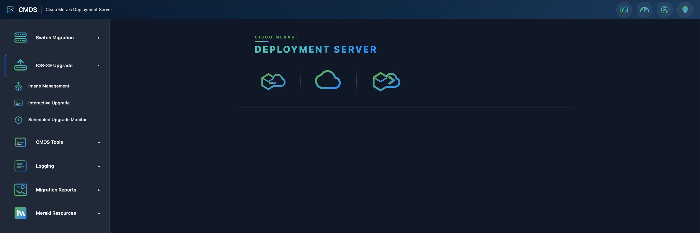
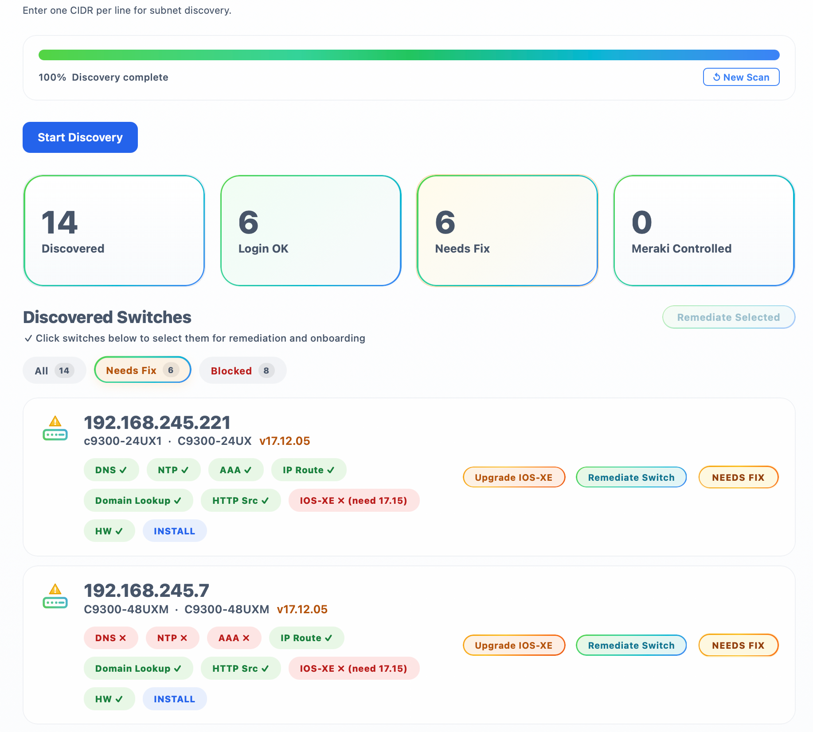
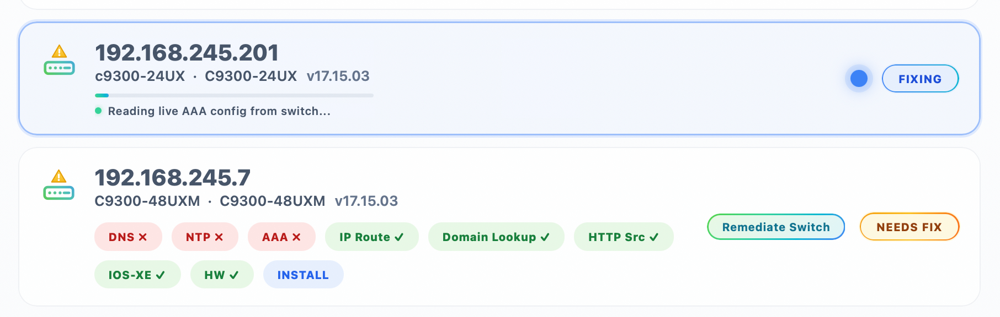
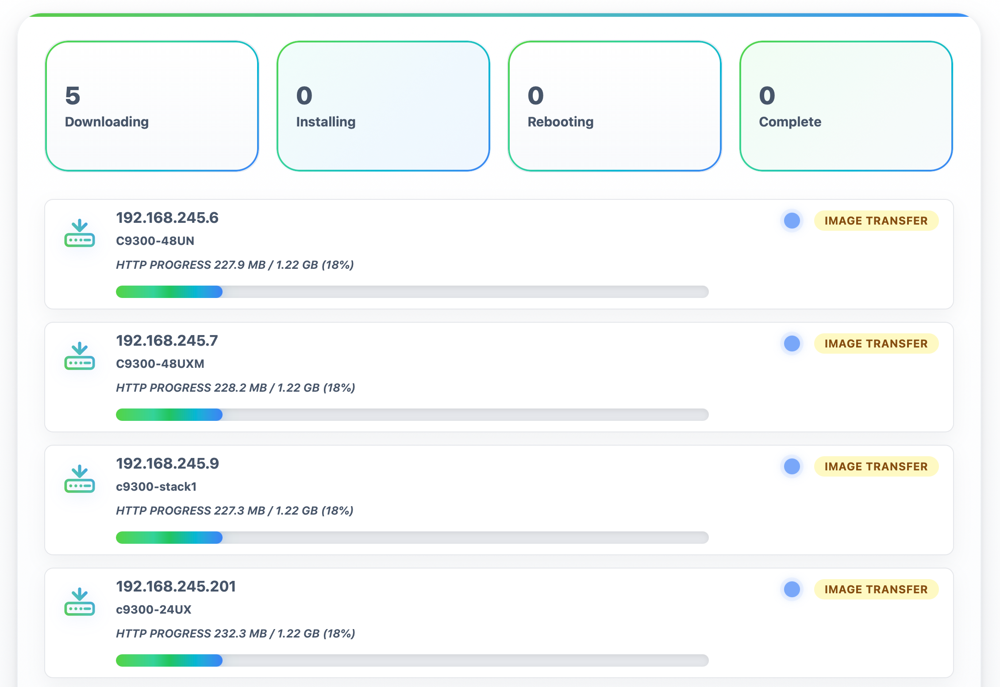
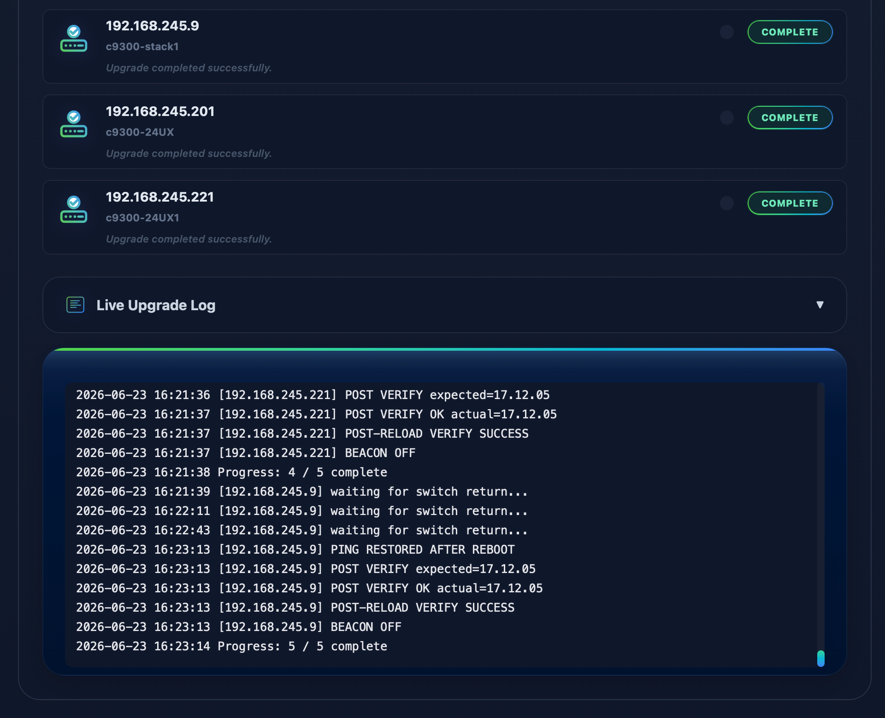
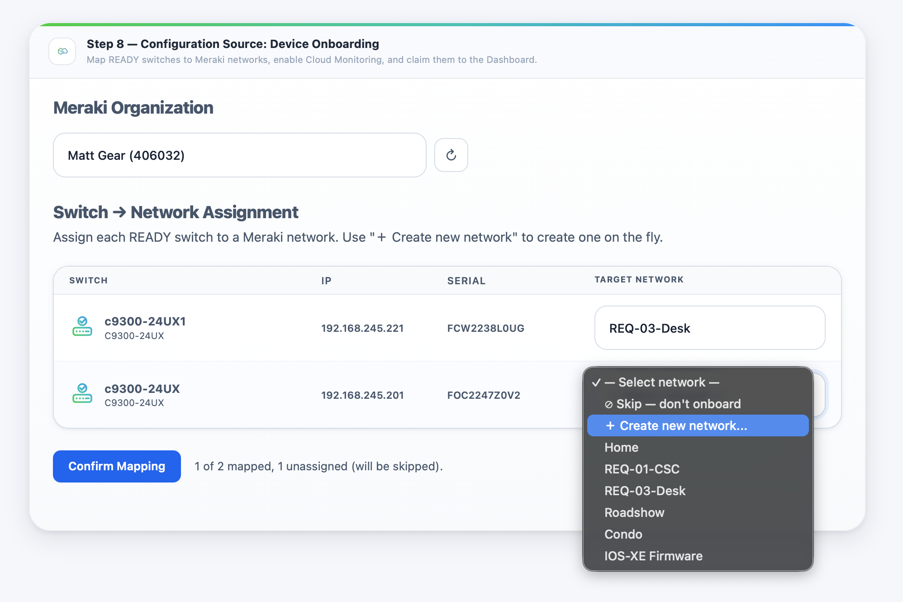
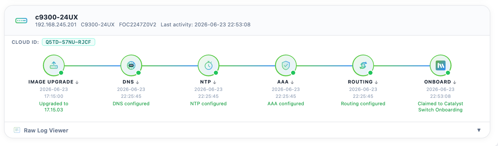
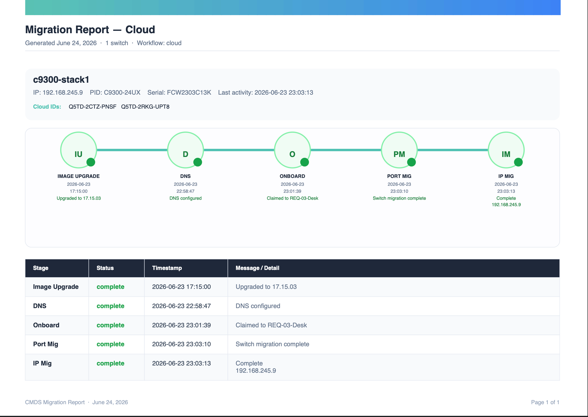
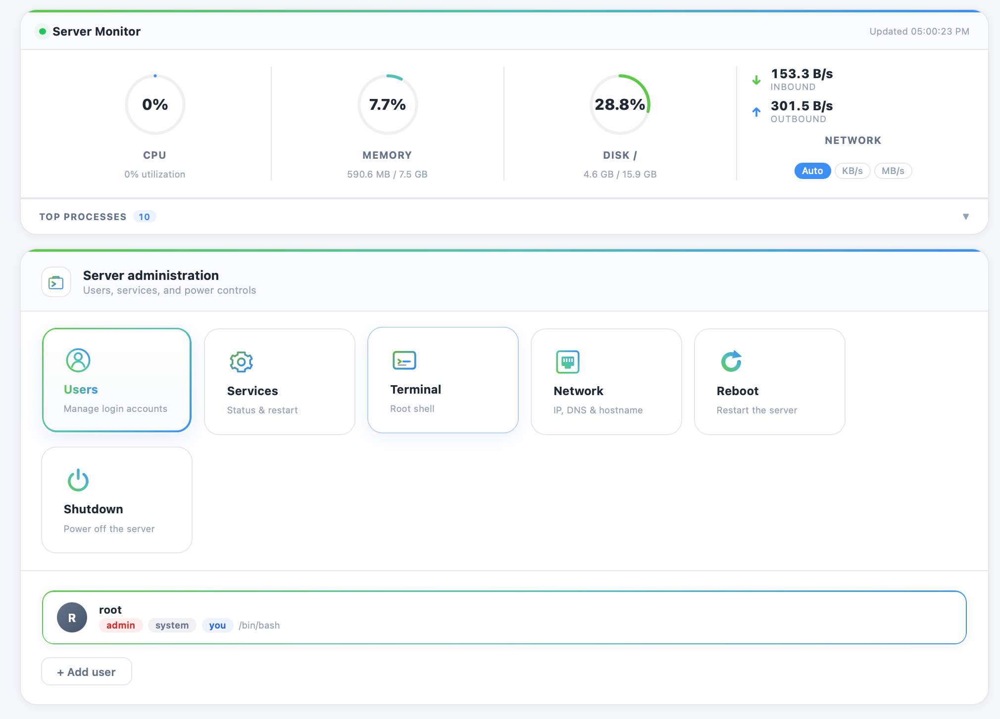

# CMDS

CMDS is a browser-based migration platform designed to streamline Catalyst-to-Meraki switch migrations.

The platform discovers switches, validates migration readiness, remediates common configuration issues, upgrades IOS-XE firmware when required, and prepares devices for onboarding into the Meraki Dashboard.

CMDS supports both modern Catalyst 9000 platforms and legacy Catalyst access switches, allowing organizations to standardize migration workflows across their switching environment.



---

## Supported Platforms

- Catalyst Legacy Series (with SSH) (296X, 365X, 375X, 3850X)
- Catalyst 9200 Series
- Catalyst 9300 Series
- Catalyst 9500 Series (NON-SVL)

---

## Migration Workflow

CMDS guides administrators through a structured migration process:

1. Discover switches
2. Validate migration readiness
3. Remediate configuration issues
4. Upgrade IOS-XE firmware (if required)
5. Onboard switches into Meraki Dashboard
6. Execute migration workflows
7. Generate migration reports

---

## Switch Discovery & Validation

Discover Catalyst switches across one or more subnets and automatically evaluate migration readiness.



Validation checks include:

- SSH connectivity
- AAA configuration
- DNS configuration
- NTP configuration
- HTTP client configuration
- Layer 3 reachability
- Hardware compatibility
- IOS-XE version compliance

---

## Automated Remediation

CMDS can automatically correct common migration blockers before onboarding begins.



Examples include:

- Missing DNS servers
- Missing NTP servers
- AAA configuration issues
- HTTP client configuration
- Management connectivity requirements

Real-time remediation progress is displayed directly within the interface.

---

## IOS-XE Firmware Management

CMDS includes integrated firmware lifecycle management to ensure devices meet migration requirements.





Features include:

- Centralized image repository
- Interactive upgrades
- Scheduled upgrades
- Stack-aware execution
- Automated reload monitoring
- Post-upgrade verification

---

## Meraki Onboarding

After validation and remediation are complete, CMDS assists with onboarding switches into Meraki Dashboard.



Capabilities include:

- Organization selection
- Network assignment
- Stack awareness
- VLAN profile preparation
- Migration workflow execution

---

## Reporting

Track migration readiness, firmware upgrades, remediation actions, and onboarding progress from a centralized reporting interface.





---

## Server Management

CMDS includes a built-in server administration panel for managing users, services, network settings, and platform health — no separate management tools required.



---

## Key Features

- Self-hosted deployment
- Browser-based management
- Catalyst-to-Meraki migration workflows
- Automated readiness validation
- Automated remediation
- Integrated IOS-XE lifecycle management
- Stack-aware operations
- Batch processing support
- Migration reporting

---

## Platform Requirements

- Rocky Linux 10.2 (Latest)
- root account enabled and SSH enabled for root
- static IP address for CMDS
- Cisco Meraki Dashboard API access
- SSH access to Catalyst switches (PRIV 15 with enable)
- Internet connectivity from the management VLAN

---

## Installation

```bash
sudo dnf -y install wget && cd "$HOME" && bash <(wget -qO- https://raw.githubusercontent.com/fumatchu/CMDS_WEB/main/CMDS_WEB-Installer.sh)
```

---

## Documentation

Complete product documentation is included with every CMDS deployment.
